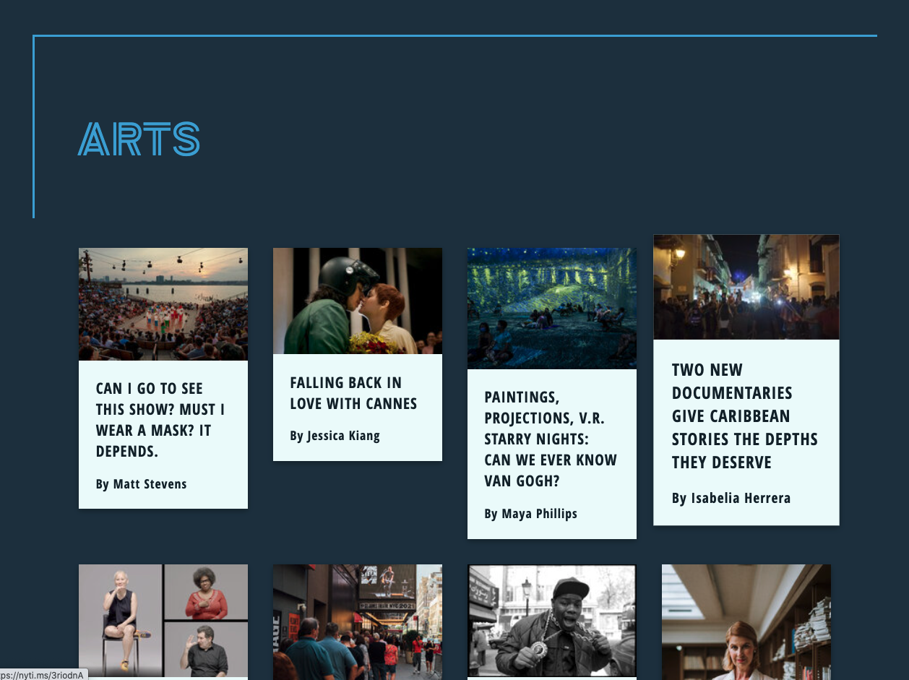
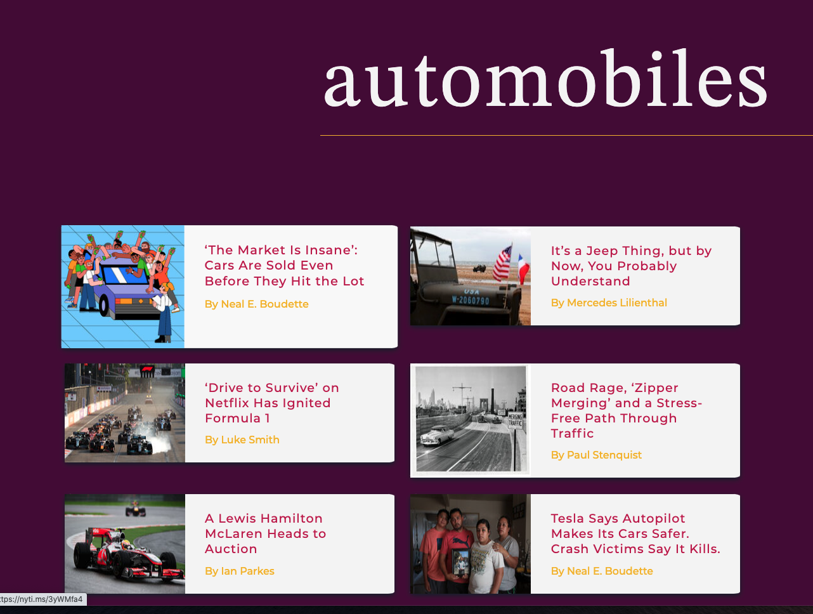
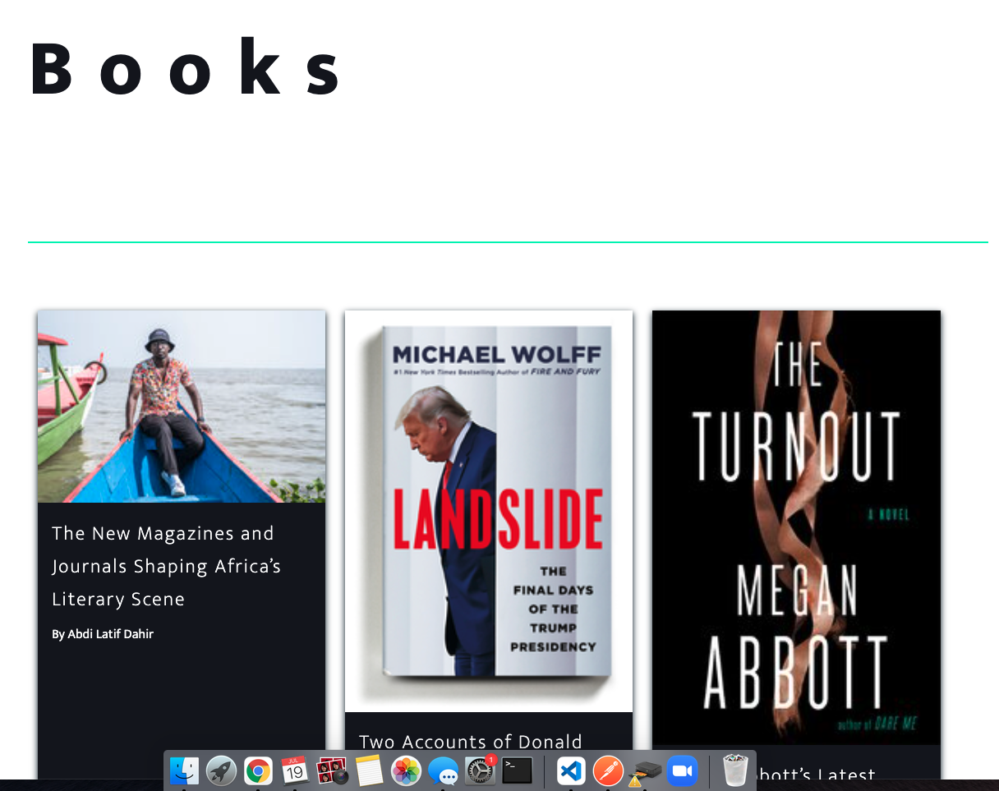

<h1 align="center"><strong>New York Times Top Stoies API Project</strong></h1>
<h2 align="center">https://teresarosinski.github.io/NyTimesTopStoriesAPI/ </h2>
<h4 align="center"><em>Vanilla Javascript Project that connects to and works with the New York Times API</em></h4>

##### __Created:__ 7/19/2021
##### __Last Updated:__ 7/19/2021 
##### By _** Teresa Rosinski**_  

## Description
This is an project that uses vanilla Javascript to connect with top stoies from the New York Times. The purpose of this project is to practice connecting to API's as well as experimenting with styles, colors and fonts. To do this, each section is styled differently. 

## Setup/Installation Requirements

* to clone this content, copy the url provided by the 'clone or download' button in GitHub
* in command line use the command 'git clone (GitHub url)'
* open the program in a code editor

## Known Bugs

* n/a

## Support and contact details

* Name: Teresa Rosinski
* Email: trosinski89@gmail.com

## Technologies Used

* Visual Studio Code
* Javascript
* New York Times API

### License

Copyright (c) 2020 **_Teresa Rosinski_**

This software is licensed under the MIT license.